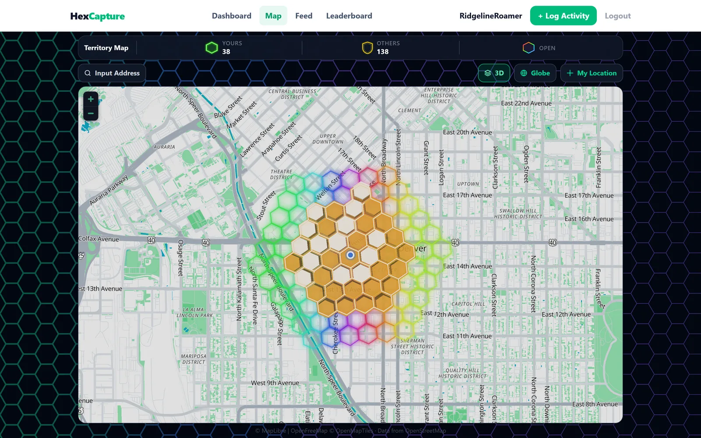
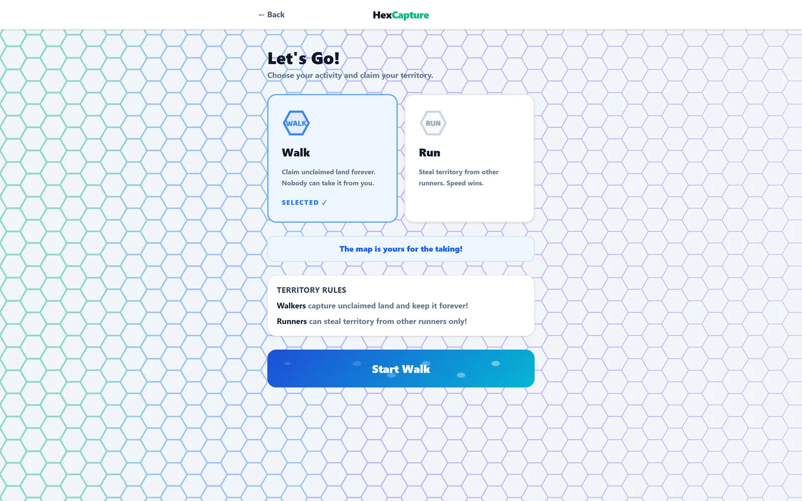

# HexCapture

**The fitness territory game.** Walk and run to capture real-world land, one hexagon at a time.

HexCapture turns everyday walking and running into a live game of territory control. As you move through the real world, your GPS trail claims hexagonal tiles on a shared map. Walkers lock down turf permanently; runners sprint through rival tiles to steal them. Your territory is visible to every other player, and the only way to defend or expand it is to get outside and move.

It ships as a **React web app** and a **React Native mobile app**, both backed by a single **Node / Express / MongoDB** API and a hexagonal geospatial engine.

<p align="center">
  
  
</p>
<p align="center">
  
</p>

## The problem it solves

Most fitness apps log your activity and stop there, and motivation fades once the novelty wears off. HexCapture adds a persistent, competitive layer to ordinary movement: your turf is public, anyone can take it, and rankings update as people move. A solo walk becomes a stake in an ongoing game, which is a far stronger reason to head outside than a step count.

## Features

- **GPS territory capture** that converts your route into H3 hexagon tiles in real time
- **Two playstyles**: walkers claim and hold permanently, runners raid and steal from other runners
- **Tiered turf** that levels from T1 to T4 the more a tile is held, shown as color and 3D height on the map
- **Live world map** with per-owner coloring, a recency glow that fades as turf ages, and a 3D skyline view
- **Leaderboards** for territory owned, distance, and activity
- **Social layer**: activity feed, follows, kudos, and public profiles
- **Segments and routes** to compete on named stretches and saved paths
- **Notifications** when someone steals your turf or your rank changes
- **Accounts** with email verification and password reset, and JWT authentication

## Tech stack

| Layer | Tech |
|-------|------|
| **Web** | React 19, Vite, React Router, MapLibre GL, H3, Tailwind CSS |
| **Mobile** | React Native (Expo SDK 54), Expo Router, react-native-maps, expo-location, expo-secure-store |
| **Backend** | Node.js, Express 5, MongoDB + Mongoose, h3-js, JWT (httpOnly cookies), bcrypt, express-rate-limit, Resend |
| **Testing** | Jest, Supertest, mongodb-memory-server |

## Architecture

Three surfaces, one API. The backend owns all the geospatial math, so both clients send a GPS path and get back the tiles that changed. That keeps the web and mobile maps in sync and gives a single source of truth for who owns what.

```
   React web app  --+
                    +-->  Express + MongoDB  -->  H3 hexagon engine
 React Native app  --+         (shared API)
```

## Engineering highlights

A few of the harder problems and how they are handled:

- **Race-condition-safe capture.** Two players can cross the same tile in the same instant. Captures run as a single atomic `findOneAndUpdate` with an aggregation pipeline, so ownership is decided in one operation with no read-then-write gap and no lost updates.
- **H3 geospatial engine.** GPS points are quantized to Uber's H3 grid (resolution 10) and de-duplicated per activity, so looping the same block does not double-count. All hex math lives on the server.
- **GPS cleaning.** Raw GPS is noisy, so points are filtered by plausible human speed (separate walk and run thresholds) before scoring. Jitter and impossible jumps never award territory.
- **Live map rendering.** Thousands of tiles render through a custom MapLibre style with 3D extruded hexes, recency-based glow, and in-place GeoJSON updates instead of full re-renders.
- **Security.** JWT in httpOnly cookies, bcrypt password hashing, `select: false` on sensitive fields, rate-limited auth routes, email verification, and API keys injected from environment config so no secret lives in the repo.

## Running locally

**Backend**
```bash
cp .env.example .env      # set MONGODB_URI and JWT_SECRET
npm install
npm run dev               # http://localhost:3000
npm test                  # Jest against an in-memory MongoDB
```

**Web**
```bash
cd territory-frontend
npm install
npm run dev               # http://localhost:5173
```

**Mobile**
```bash
cd territory-mobile
npm install
npx expo start            # scan the QR code with Expo Go
```

## Status

Actively developed. The web app and backend are the most complete; the native mobile app implements the core flows (auth, map, activity tracking, leaderboard, feed, and profiles) 

---

Designed and built end to end by **Travis McGray**.
